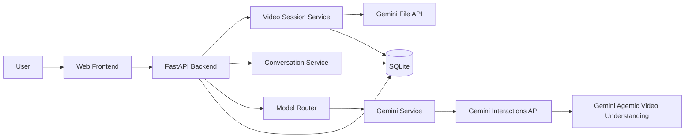
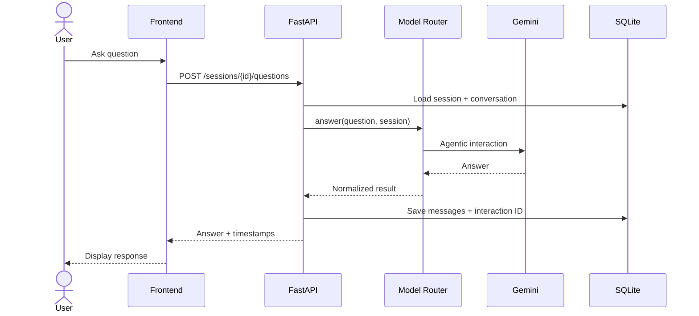
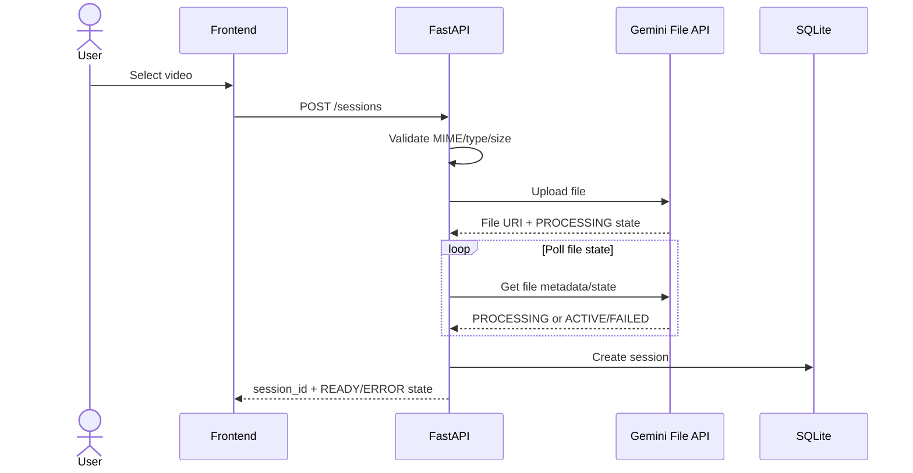
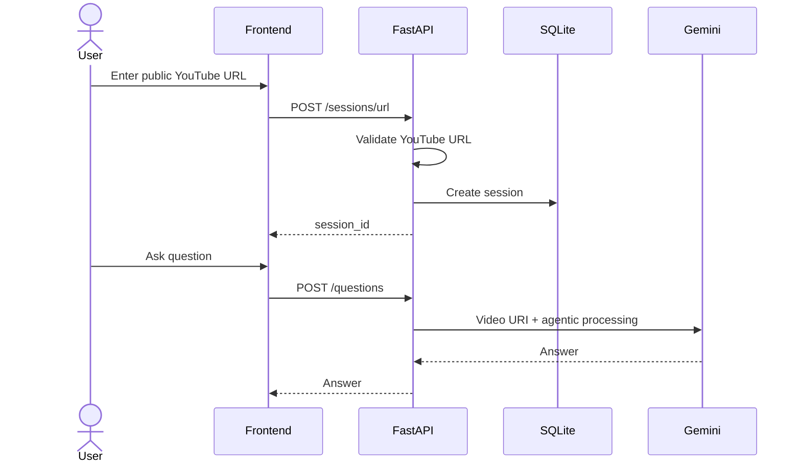
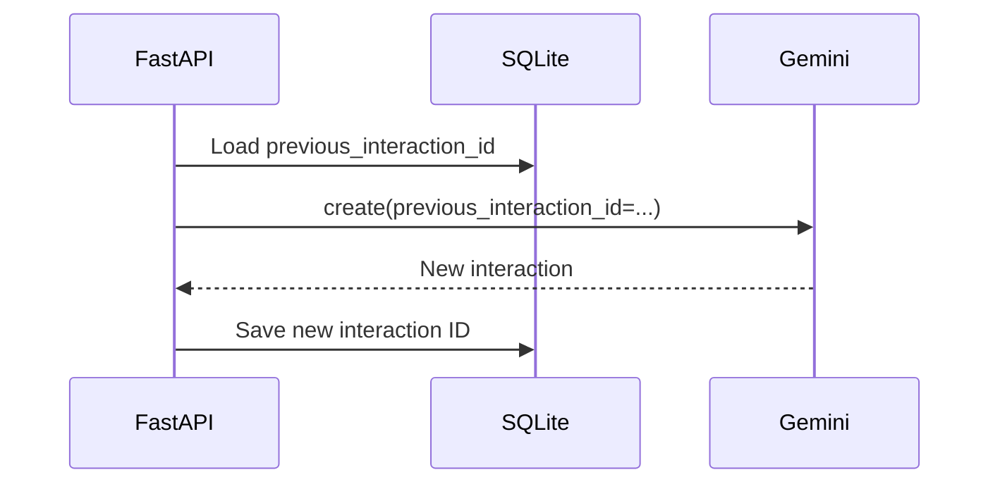
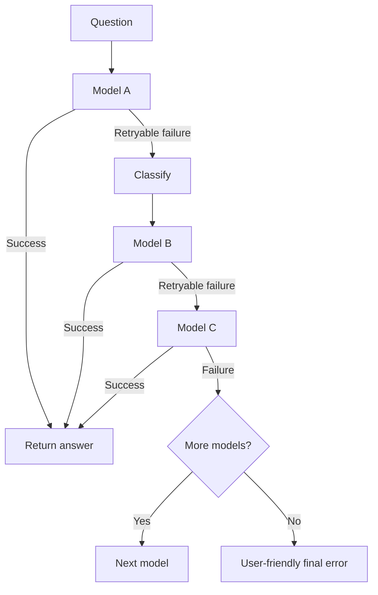

# Video AI Assistant — Architecture

**Status:** MVP Source of Truth  
**Last verified:** 2026-09-09

## 1. Architectural Goal

Build the smallest useful application around Gemini's native video understanding.



## 2. Components

### Frontend

Responsibilities:

- upload/select video;
- enter YouTube URL;
- show session status;
- display video preview where feasible;
- display chat messages;
- submit questions;
- display timestamps;
- show errors and retry controls.

The frontend must not call Gemini directly.

### FastAPI Backend

Responsibilities:

- HTTP API;
- request validation;
- session lifecycle;
- upload handling;
- conversation persistence;
- invoking the model router;
- mapping Gemini errors to application errors.

### Video Session Service

Responsibilities:

- validate source;
- upload files through the Gemini File API when needed;
- store the resulting Gemini file reference;
- create and manage application session metadata.

It must not analyze frames or transcribe the video itself.

### Gemini Service

A narrow adapter around the official `google-genai` SDK.

Responsibilities:

- create interactions;
- pass video input;
- request agentic processing;
- continue same-model conversations;
- normalize Gemini responses/errors.

### Model Router

Responsibilities:

- read configured eligible models;
- order models by priority;
- classify errors;
- decide whether fallback is allowed;
- invoke the Gemini service;
- stop after success or maximum attempts.

### Conversation Service

Responsibilities:

- application message persistence;
- session lookup;
- same-model interaction ID tracking;
- handling fallback context reconstruction.

### Database

SQLite for MVP.

Stores application metadata, not Gemini's entire internal execution state.

## 3. High-Level Request



## 4. Video Upload Flow



Google recommends the File API for large files and files reused across multiple requests. Standard File API uploads are currently stored for 48 hours. [File API](https://ai.google.dev/gemini-api/docs/files)

## 5. YouTube Flow



## 6. Follow-Up Flow

For the same active model:



The Interactions API explicitly supports `previous_interaction_id` for server-side conversation state. [Interactions API](https://ai.google.dev/gemini-api/docs/interactions-overview)

## 7. Fallback Flow



A model switch is a new routing attempt. The application must not assume that a previous Gemini interaction ID can be reused across models. If fallback happens, the router shall use the application's stored conversation context and the video input to establish a new interaction.

## 8. Database Responsibility

The database is the application's source of session metadata and visible conversation history.

It is not a replacement for Gemini's internal video understanding or interaction state.

## 9. Configuration

Configuration shall include:

- `GEMINI_API_KEY`
- ordered model IDs;
- request timeout;
- maximum fallback attempts;
- upload size limit;
- allowed MIME types;
- database URL;
- CORS origins.

## 10. No Custom Video Pipeline

Do not add:

```text
Video
 -> FFmpeg
 -> frames
 -> Whisper
 -> embeddings
 -> vector DB
 -> custom retrieval
 -> Gemini
```

unless a later documented requirement proves Gemini-native processing insufficient.

The current Gemini API already supports dynamic video exploration in agentic mode. [Video understanding](https://ai.google.dev/gemini-api/docs/video-understanding)
