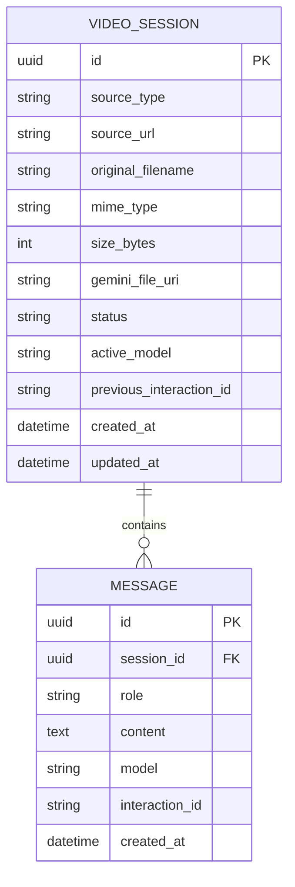

# Video AI Assistant — Database Design

**Status:** MVP Source of Truth  
**Last verified:** 2026-09-09

## 1. Database

Use SQLite for initial development.

Recommended ORM:

- SQLModel, or
- SQLAlchemy with Pydantic schemas.

SQLite is sufficient because MVP is a single-application development deployment.

## 2. Entity Relationship



## 3. VideoSession

Fields:

| Field | Type | Required | Purpose |
|---|---|---:|---|
| `id` | UUID | yes | Application session ID |
| `source_type` | enum/string | yes | `upload` or `youtube` |
| `source_url` | text | no | YouTube URL |
| `original_filename` | text | no | Original upload filename |
| `mime_type` | text | no | Uploaded MIME type |
| `size_bytes` | integer | no | Upload size |
| `gemini_file_uri` | text | no | Gemini File API URI |
| `status` | enum/string | yes | Session lifecycle |
| `active_model` | text | no | Last successful Gemini model |
| `previous_interaction_id` | text | no | Same-model conversation state |
| `created_at` | datetime | yes | Creation time |
| `updated_at` | datetime | yes | Last update |

## 4. Message

Fields:

| Field | Type | Required |
|---|---|---:|
| `id` | UUID | yes |
| `session_id` | UUID FK | yes |
| `role` | enum/string | yes |
| `content` | text | yes |
| `model` | text | no |
| `interaction_id` | text | no |
| `created_at` | datetime | yes |

Index:

```text
(session_id, created_at)
```

This supports efficient chronological conversation retrieval.

## 5. Why Not Store Gemini's Full State?

Gemini's Interactions API already maintains its own interaction state when storage is enabled.

The local database only needs enough state to:

- display the conversation;
- associate the session with the video;
- know the active model;
- continue same-model interaction;
- reconstruct context after fallback.

This avoids duplicating external provider state unnecessarily.

## 6. File URI Expiration

A `gemini_file_uri` is not permanent.

Standard File API uploads are currently stored for 48 hours. The application must therefore treat the URI as temporary. [File API](https://ai.google.dev/gemini-api/docs/files)

## 7. Retention

MVP does not require indefinite data retention.

A later production system may introduce:

- configurable session retention;
- user-owned data deletion;
- automated cleanup.

## 8. Migrations

Use a migration tool once schema evolution becomes necessary.

For the first local prototype, `SQLModel.metadata.create_all()` is acceptable, but production changes should use controlled migrations.

## 9. Database URL

Default:

```env
DATABASE_URL=sqlite:///./video_ai_assistant.db
```

## 10. Privacy

Do not store:

- API keys;
- authorization headers;
- raw uploaded video bytes in SQLite;
- Gemini internal reasoning traces;
- unnecessary sensitive metadata.
